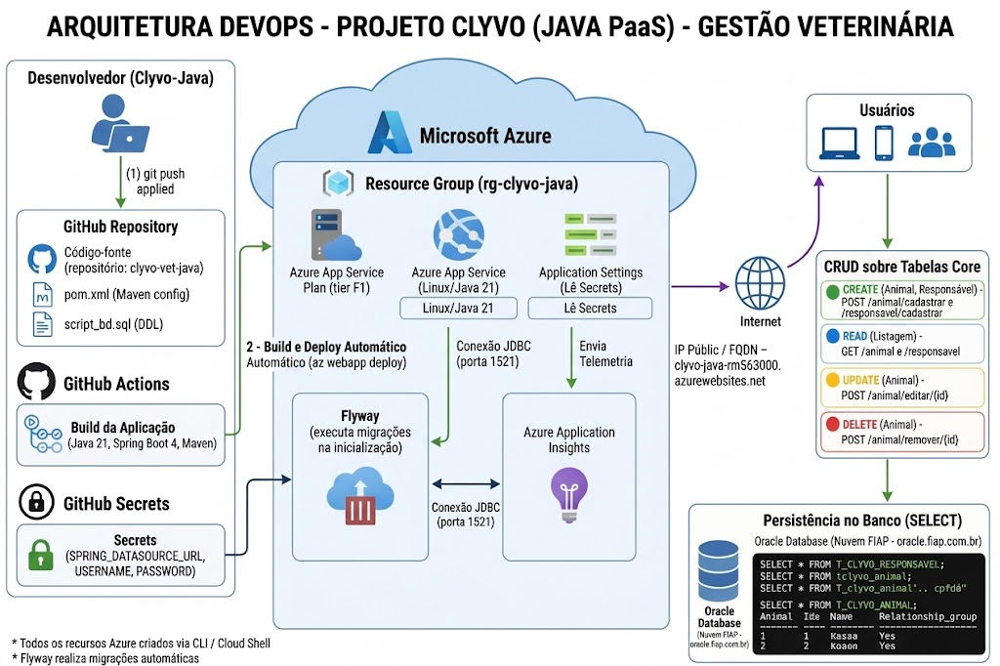

# Clyvo - Gestao Veterinaria (Deploy em Nuvem - Azure App Service)

Sistema de gestao veterinaria com aplicacao web em Java Spring Boot e banco de dados Oracle, implantado no Azure App Service com pipeline de CI/CD automatizado via GitHub Actions.

## Indice

- Sobre o Projeto
- Beneficios para o Negocio
- Arquitetura
- Tecnologias Utilizadas
- Estrutura do Repositorio
- Pre-requisitos
- Instalacao (How-To)
- Testes do CRUD
- Seguranca
- Custos e Limpeza dos Recursos
- Observacoes Tecnicas
- Integrantes

## Sobre o Projeto

O Clyvo centraliza o gerenciamento de uma clinica veterinaria: cadastro de animais, responsaveis e veterinarios, alem do agendamento de consultas e do controle de aplicacao de vacinas. A aplicacao ja existia como sistema web local (Spring MVC com Thymeleaf e Spring Security) e, nesta entrega, foi levada para a nuvem, com deploy continuo via Azure App Service e banco de dados Oracle hospedado na nuvem da FIAP.

## Beneficios para o Negocio

- Elimina o controle manual/em papel de fichas de animais, substituindo por um cadastro unico e consultavel a qualquer momento.
- Evita conflitos de agenda: o sistema impede que um mesmo veterinario tenha duas consultas marcadas na mesma data.
- Reduz risco a saude dos animais ao bloquear a reaplicacao indevida de uma vacina antes do prazo minimo entre doses.
- Separa o acesso por perfil (administracao versus atendimento), reduzindo o risco de alteracoes indevidas em dados de cadastro (veterinarios, doencas, vacinas).
- Hospedar a aplicacao na nuvem elimina a necessidade de manter um servidor fisico na clinica, com deploy automatico a cada atualizacao de codigo (CI/CD), reduzindo o tempo entre o desenvolvimento e a entrega de melhorias.

## Arquitetura

- Opcao escolhida: Azure App Service (sem containerizacao)
- Banco de dados: Oracle Database, na nuvem da FIAP (oracle.fiap.com.br)
- Aplicacao: Java 21, Spring Boot 4, Spring MVC, Thymeleaf, Spring Security
- Controle de versao do banco: Flyway
- CI/CD: GitHub Actions (build com Maven e deploy automatico a cada push)
- Monitoramento: Azure Application Insights
- Custo: Azure App Service Plan no tier F1 (gratuito), compativel com o limite do Azure for Students

Diagrama da arquitetura:



## Tecnologias Utilizadas

- Java 21
- Spring Boot 4 (Spring MVC, Spring Data JPA, Spring Security)
- Thymeleaf
- Flyway
- Oracle Database
- Maven
- Azure CLI / Azure Cloud Shell
- Azure App Service, Azure Application Insights
- GitHub Actions

## Estrutura do Repositorio

Diferente de arquiteturas containerizadas, que costumam dividir o projeto em multiplos repositorios (aplicacao, banco de dados, scripts de infraestrutura), esta entrega usa um unico repositorio: o Azure App Service publica o pacote compilado da aplicacao diretamente, sem depender de imagens Docker separadas.

| Item | Conteudo |
|---|---|
| src/ | Codigo-fonte da aplicacao (Controllers, Models, Repositories, Security) |
| src/main/resources/db/migration | Scripts de migracao do Flyway (V1, V2) |
| script_bd.sql | DDL completo das tabelas com comentarios, entregue separadamente conforme exigido |
| pom.xml | Dependencias e configuracao de build do Maven |
| .github/workflows | Pipeline de CI/CD, gerado automaticamente pelo Azure CLI |
| arquitetura_v2.svg | Diagrama da arquitetura da solucao |

## Pre-requisitos

- Conta ativa no Microsoft Azure (utilizamos Azure for Students)
- Acesso ao Azure Cloud Shell
- Conta no GitHub, com permissao para criar Secrets no repositorio
- Acesso a um banco de dados Oracle (utilizamos o disponibilizado pela FIAP)

## Instalacao (How-To)

Todos os comandos abaixo sao executados no Azure Cloud Shell, exceto onde indicado.

### 1. Clonar o repositorio

```
git clone https://github.com/enzovbernard/DevopsChallengClyvo.git
cd DevopsChallengClyvo
```

### 2. Registrar os provedores e a extensao necessarios

```
az provider register --namespace Microsoft.Web
az provider register --namespace Microsoft.Insights
az provider register --namespace Microsoft.OperationalInsights
az provider register --namespace Microsoft.ServiceLinker
az extension add --name application-insights
```

### 3. Definir as variaveis e criar o Grupo de Recursos

```
RESOURCE_GROUP_NAME="rg-clyvo-java"
WEBAPP_NAME="clyvo-java-rm563000"
APP_SERVICE_PLAN="clyvo-java"
LOCATION="brazilsouth"
RUNTIME="JAVA:21-java21"
GITHUB_REPO_NAME="enzovbernard/DevopsChallengClyvo"
BRANCH="main"
APP_INSIGHTS_NAME="ai-clyvo-java"

az group create --name $RESOURCE_GROUP_NAME --location "$LOCATION"
```

### 4. Criar o Application Insights e o Plano de Servico

```
az monitor app-insights component create \
  --app $APP_INSIGHTS_NAME \
  --location "$LOCATION" \
  --resource-group $RESOURCE_GROUP_NAME \
  --application-type web

az appservice plan create \
  --name $APP_SERVICE_PLAN \
  --resource-group $RESOURCE_GROUP_NAME \
  --location "$LOCATION" \
  --sku F1 \
  --is-linux
```

### 5. Criar o Web App e habilitar a autenticacao basica (SCM)

```
az webapp create \
  --name $WEBAPP_NAME \
  --resource-group $RESOURCE_GROUP_NAME \
  --plan $APP_SERVICE_PLAN \
  --runtime "$RUNTIME"

az resource update \
  --resource-group $RESOURCE_GROUP_NAME \
  --namespace Microsoft.Web \
  --resource-type basicPublishingCredentialsPolicies \
  --name scm \
  --parent sites/$WEBAPP_NAME \
  --set properties.allow=true
```

### 6. Conectar o Application Insights e configurar as variaveis de ambiente do banco

```
CONNECTION_STRING=$(az monitor app-insights component show \
  --app $APP_INSIGHTS_NAME \
  --resource-group $RESOURCE_GROUP_NAME \
  --query connectionString \
  --output tsv)

az webapp config appsettings set \
  --name "$WEBAPP_NAME" \
  --resource-group "$RESOURCE_GROUP_NAME" \
  --settings \
    APPLICATIONINSIGHTS_CONNECTION_STRING="$CONNECTION_STRING" \
    ApplicationInsightsAgent_EXTENSION_VERSION="~3" \
    XDT_MicrosoftApplicationInsights_Mode="Recommended" \
    XDT_MicrosoftApplicationInsights_PreemptSdk="1" \
    SPRING_DATASOURCE_USERNAME="seu-usuario-oracle" \
    SPRING_DATASOURCE_PASSWORD="sua-senha-oracle" \
    SPRING_DATASOURCE_URL="jdbc:oracle:thin:@//oracle.fiap.com.br:1521/ORCL"

az webapp restart --name $WEBAPP_NAME --resource-group $RESOURCE_GROUP_NAME

az monitor app-insights component connect-webapp \
  --app $APP_INSIGHTS_NAME \
  --web-app $WEBAPP_NAME \
  --resource-group $RESOURCE_GROUP_NAME
```

### 7. Configurar o CI/CD com GitHub Actions

```
az webapp deployment github-actions add \
  --name $WEBAPP_NAME \
  --resource-group $RESOURCE_GROUP_NAME \
  --repo $GITHUB_REPO_NAME \
  --branch $BRANCH \
  --login-with-github
```

Este comando cria automaticamente um workflow no repositorio. O primeiro build falha propositalmente, pois o Maven executa os testes da aplicacao, que precisam se conectar ao Oracle sem ainda ter as credenciais disponiveis nesse ambiente.

### 8. Criar os Secrets no GitHub

No repositorio, va em Settings > Secrets and variables > Actions > New repository secret, e crie:

| Nome | Valor |
|---|---|
| SPRING_DATASOURCE_URL | jdbc:oracle:thin:@//oracle.fiap.com.br:1521/ORCL |
| SPRING_DATASOURCE_USERNAME | substitua pelo usuario Oracle de quem for executar o deploy (ex: rm000000) |
| SPRING_DATASOURCE_PASSWORD | substitua pela senha correspondente a esse usuario |

A URL é a mesma para qualquer aluno ou professor da FIAP, pois aponta para o mesmo servidor Oracle compartilhado. Apenas o usuario e a senha mudam, pois correspondem ao schema pessoal de cada conta dentro desse servidor. Caso outra pessoa reutilize este roteiro com sua propria conta Oracle, o Flyway cria o schema completo do zero automaticamente na primeira execucao, sem nenhum passo manual adicional.

Se o schema Oracle utilizado ja tiver tabelas remanescentes de uma tentativa anterior com os mesmos nomes (prefixo T_CLYVO_), o Flyway pode acusar "schema nao vazio" na primeira execucao. Nesse caso, basta remover essas tabelas antigas (ou usar um schema Oracle limpo) antes de rodar o deploy novamente.

### 9. Editar o arquivo de workflow gerado

No arquivo `.github/workflows/main_<nome-do-app>.yml`, localize o passo de build e adicione a secao `env`:

```yaml
- name: Build with Maven
  run: mvn clean install
  env:
    SPRING_DATASOURCE_URL: ${{ secrets.SPRING_DATASOURCE_URL }}
    SPRING_DATASOURCE_USERNAME: ${{ secrets.SPRING_DATASOURCE_USERNAME }}
    SPRING_DATASOURCE_PASSWORD: ${{ secrets.SPRING_DATASOURCE_PASSWORD }}
```

Salve o commit direto pela interface do GitHub. Isso dispara um novo build, que desta vez tem acesso as credenciais e deve concluir com sucesso.

### 10. Acessar a aplicacao

```
https://clyvo-java-rm563000.azurewebsites.net/login
```

Na primeira execucao, o Flyway cria automaticamente todo o schema Oracle e popula os usuarios iniciais, sem necessidade de rodar nenhum script manualmente.

## Testes do CRUD

O CRUD demonstrado esta sobre as tabelas Animal e Responsavel, que sao relacionadas entre si (um animal pertence a um responsavel). Todas as operacoes sao feitas pela interface web (a aplicacao nao expoe uma API REST) e podem ser conferidas diretamente no banco via SELECT no SQL Developer, conectado com as mesmas credenciais Oracle configuradas no passo 6.

### CREATE - Cadastrar Responsavel e Animal

1. Logue na aplicacao (usuario admin, senha 1234)
2. Va em Responsaveis > Cadastrar Responsavel e preencha o formulario
3. Va em Animais > Cadastrar Animal, preencha o formulario e selecione o responsavel criado
4. Confirme no banco:

```sql
SELECT * FROM T_CLYVO_RESPONSAVEL;
SELECT * FROM T_CLYVO_ANIMAL;
```

### READ - Consultar

1. Va em Animais e Responsaveis para ver a listagem
2. Clique em Detalhes em qualquer registro para ver a visualizacao individual

### UPDATE - Editar

1. Na listagem de Animais, clique em Editar em um registro
2. Altere um campo (por exemplo, o peso) e salve
3. Confirme no banco:

```sql
SELECT id_animal, nm_animal, peso FROM T_CLYVO_ANIMAL WHERE id_animal = <id>;
```

### DELETE - Remover

1. Na listagem de Animais, clique em Remover em um registro
2. Confirme no banco que o registro nao aparece mais:

```sql
SELECT * FROM T_CLYVO_ANIMAL WHERE id_animal = <id>;
```

## Seguranca

- Nenhuma credencial (usuario, senha do Oracle) fica exposta no codigo-fonte: as configuracoes de conexao no `application.properties` usam variaveis de ambiente (`${SPRING_DATASOURCE_URL}`, etc.), preenchidas em tempo de execucao pelas Configuracoes do Web App no Azure.
- No pipeline de CI/CD, as mesmas credenciais ficam armazenadas como Secrets criptografados do GitHub, nunca em texto plano no repositorio.
- As senhas dos usuarios da aplicacao sao armazenadas com hash BCrypt.
- A aplicacao usa Spring Security com dois perfis de acesso (ADMIN e USER), com rotas de cadastro restritas por perfil.

## Custos e Limpeza dos Recursos

O Azure App Service Plan foi mantido no tier F1 (gratuito), e o Application Insights opera dentro da camada gratuita padrao, mantendo o custo compativel com o limite do Azure for Students. Apos a gravacao do video de demonstracao, os recursos sao removidos:

```
az group delete --name $RESOURCE_GROUP_NAME --yes --no-wait
```


## Integrantes

- Caio Kenzo Tayra - RM562979
- Enzo Vieira Bernardini - RM563000
- Nicolas Mota Cândido - RM561857